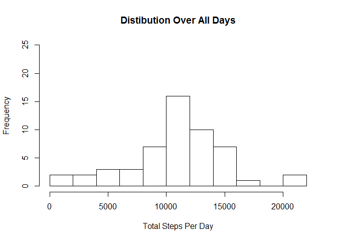
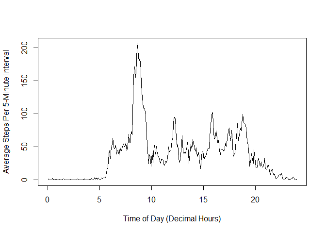
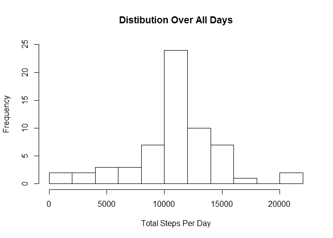
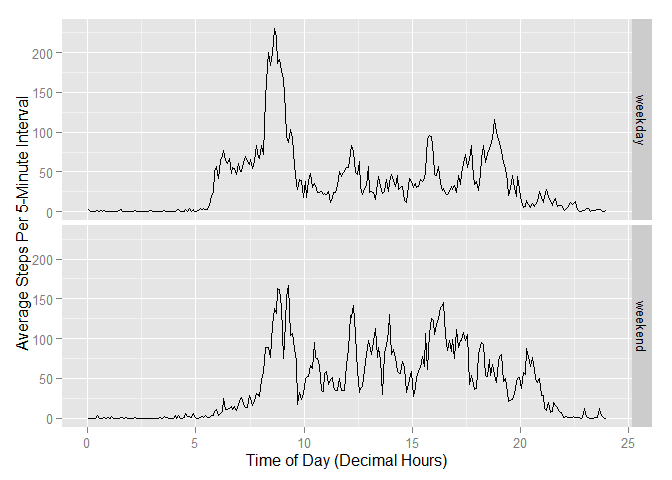

# Peer Assessment 1
Steve Rust  
September 8, 2015  

#Introduction

This report documents the analysis of the Activity Monitoring dataset.

#Loading and preprocessing the data

The first step after setting the working directory was to load the data.


```r
activity <- read.csv("activity.csv")
```


I then added a time variable to represent intervals well on a time scale and created a version of the original dataset for which records containing missing values for the ***steps*** variable were eliminated.


```r
hour <- floor(activity$interval / 100)
minutes <- activity$interval - 100*hour
fractional_hour <- (minutes + 2.5) / 60
activity$time <- hour + fractional_hour

activity_nona <- activity[!is.na(activity$steps),]
```


#What is mean total number of steps taken per day?

Using the dataset without missing values, I created a new dataset containing the total number of steps by day and produced the following histogram for total number of daily steps.


```r
total_steps <- setNames(aggregate(activity_nona$steps, by=list(Category=activity_nona$date),                             FUN=sum, na.rm=TRUE), c("Date", "total_steps"))
hist(total_steps$total_steps, ylim=c(0,25), breaks=10, xlab="Total Steps Per Day",
     main="Distibution Over All Days")
```

 


The mean and median total number of steps per day, respectively, are as follows. 


```r
mean(total_steps$total_steps, na.rm=TRUE)
```

```
## [1] 10766.19
```

```r
median(total_steps$total_steps, na.rm=TRUE)
```

```
## [1] 10765
```

#What is the average daily activity pattern?

Going back to the original dataset, I created a new dataset containing the average number of steps by 5-minute interval and produced the following plot of average number of steps vs. time of day.


```r
average_steps <- setNames(aggregate(activity$steps, by=list(time=activity$time), FUN=mean,                                 na.rm=TRUE), c("time", "average_steps"))
plot(average_steps$time, average_steps$average_steps, type="l",
     ylab="Average Steps Per 5-Minute Interval", xlab="Time of Day (Decimal Hours)")
```

 


The time interval with the largest average number of steps occurs at the following time in units of decimal hours.


```r
average_steps$time[which.max(average_steps$average_steps)]
```

```
## [1] 8.625
```

#Imputing missing values

There are a number of missing values for the ***steps*** variable.  The number of time intervals for which the ***steps*** variable is missing is reported below.


```r
sum(is.na(activity$steps))
```

```
## [1] 2304
```

Before performing additional analyses, I replaced each missing value for the ***steps*** variable with the interval average previously computed.


```r
#Merge interval averages into data.frame and sort
activity2 <- merge(activity, average_steps, by="time")
activity2 <- activity2[order(activity2$date, activity2$interval),]
row.names(activity2) <- NULL

#Preserve raw steps values in new variable and replace missing steps values with interval averages 
activity2$raw_steps <- activity2$steps
activity2$steps[is.na(activity2$steps)] <- activity2$average_steps[is.na(activity2$steps)]
```


The following figure is a new histogram for total number of daily steps.  Notice that the imputation of missing values has increased the frequency of the most frequent interval by 8 observations.


```r
total_steps2 <- setNames(aggregate(activity2$steps, by=list(Category=activity2$date), FUN=sum, na.rm=TRUE),
                         c("Date", "total_steps2"))
hist(total_steps2$total_steps2, ylim=c(0,25), breaks=10, xlab="Total Steps Per Day",
     main="Distibution Over All Days")
```

 


New values of the mean and median total number of steps per day, respectively, are as follows.  Notice that the median is now equal to the mean because, essentially, 8 observations with that number of steps were added to the dataset.  


```r
mean(total_steps2$total_steps2, na.rm=TRUE)
```

```
## [1] 10766.19
```

```r
median(total_steps2$total_steps2, na.rm=TRUE)
```

```
## [1] 10766.19
```

#Are there differences in activity patterns between weekdays and weekends?

In order to compare weekday versus weekend activity patterns, a ***daytype*** variable was added to the dataset.  The variable takes either the value "weekday" or "weekend".


```r
activity2$dayofweek <- weekdays(as.Date(activity2$date))
for (i in 1:length(activity2$dayofweek)) {
    if (activity2$dayofweek[i] %in% c("Saturday","Sunday")) {activity2$daytype[i] <- "weekend"}
        else {activity2$daytype[i] <- "weekday"}
}
```


The following figure contains separate plots of average number of steps vs. time of day for "weekdays" and "weekends".  Note that the weekend activity pattern is much more uniform from 08:00 to 21:00 with activity diminishing slightly as the day progresses.  In contrast, "weekday" activity has peaks of higher activity at specific times (e.g., ~08:30, ~12:15, ~16:00, ~17.45, ~18:45) puncuated by periods of very low activity (< 50 steps per 5 minute period). 


```r
average_steps2 <- setNames(aggregate(activity2$steps, by=list(time=activity2$time,                                          daytype=activity2$daytype), FUN=mean, na.rm=TRUE),
                           c("time", "daytype", "average_steps2"))
library(ggplot2)
g <- ggplot(average_steps2, aes(time,average_steps2))
g + geom_line(aes(time,average_steps2)) + facet_grid(daytype ~ .) + 
    labs(list(y="Average Steps Per 5-Minute Interval", x="Time of Day (Decimal Hours)"))
```

 


